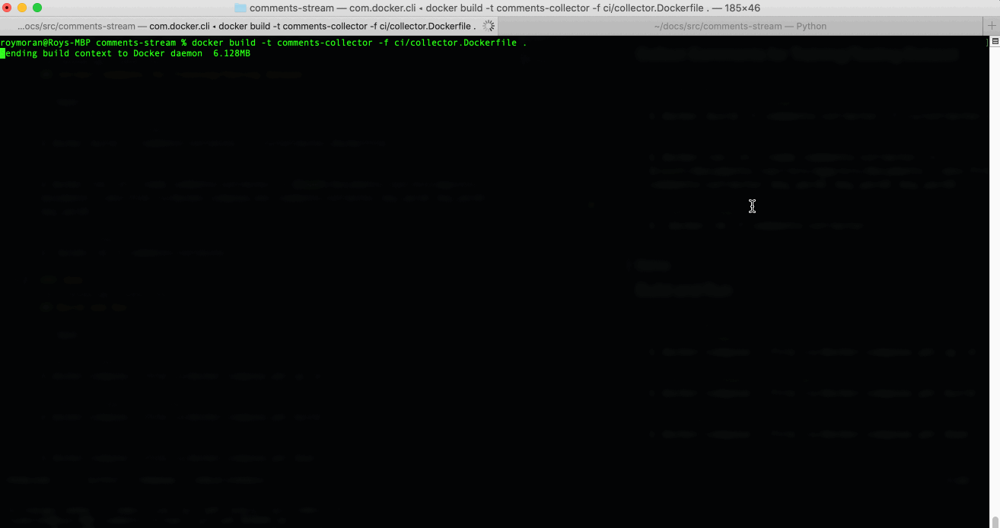

## Comment Stream

Find comments of interests on social platforms using a classifier trained on comment data that you collect.

## Platforms Currently Supported

- Reddit

## Setup Reddit App Variables

TODO: Add information about creating a reddit app (for now credentials are provided in `docker-compose.env.example`)

```bash
# from repo root, create docker-compose.env file
$ cp ci/docker-compose.env.example ci/docker-compose.env
```
## Collect Comments for Training/Testing Dataset

```bash
# from repo root
# build collector image
$ docker build -t comments-collector -f ci/collector.Dockerfile .

# run container and pass keywords
$ docker run -it --name comments-collector -v $(pwd)/documents:/usr/src/app/src/documents --env-file ci/docker-compose.env comments-collector key_word1 key_word2 key_word3

# remove image when done
$ docker rm -f comments-collector
```
### Demo

## Build and Run

```bash
# from repo root
# docker compose up
$ docker-compose --file ci/docker-compose.yml up -d

# rebuild images on changes
$ docker-compose --file ci/docker-compose.yml build

# when done
$ docker-compose --file ci/docker-compose.yml down
```
